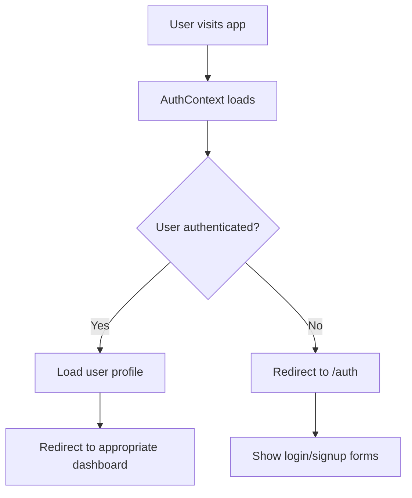
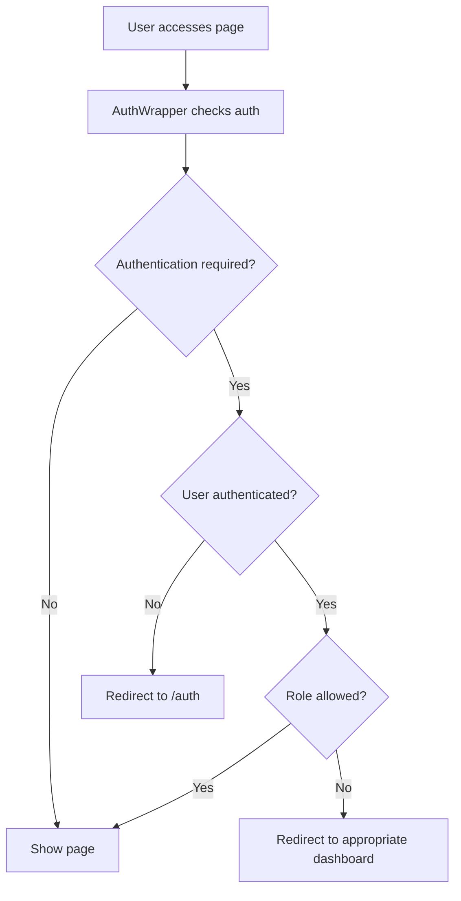
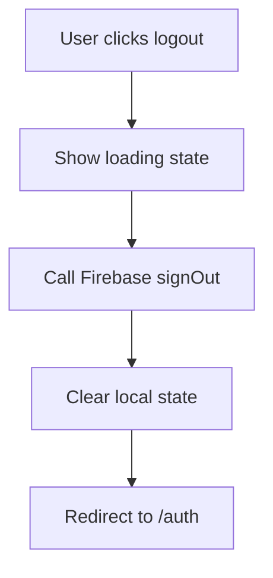

# SafeMeds Authentication System

## Overview

The SafeMeds authentication system provides a comprehensive, role-based authentication solution with Firebase integration. The system features automatic routing, protected pages, and seamless user experience with proper authentication state management.

## 🔐 **System Features**

### **Authentication Management**

- **Firebase Integration**: Secure authentication with Firebase Auth
- **Role-Based Access**: Separate dashboards for clients and pharmacy users
- **Automatic Routing**: Smart redirects based on authentication status
- **Session Management**: Persistent authentication state
- **Secure Logout**: Complete session termination

### **User Experience**

- **Loading States**: Smooth loading animations during authentication checks
- **Error Handling**: Comprehensive error messages and recovery
- **Responsive Design**: Optimized for all device sizes
- **Access Control**: Role-based page protection

## 🛠️ **Technical Implementation**

### **Core Components**

#### **AuthContext** (`src/context/AuthContext.tsx`)

The central authentication state management system:

```typescript
interface AuthContextType {
  user: User | null;
  userProfile: UserProfile | null;
  loading: boolean;
  isAuthenticated: boolean;
  setIsAuthenticated: (value: boolean) => void;
  refreshUserProfile: () => Promise<void>;
  logout: () => Promise<void>;
}
```

**Features:**

- Real-time authentication state tracking
- User profile management
- Automatic session restoration
- Secure logout functionality

#### **AuthWrapper** (`src/components/Auth/AuthWrapper.tsx`)

The authentication routing and protection component:

```typescript
interface AuthWrapperProps {
  children: React.ReactNode;
  requireAuth?: boolean;
  allowedRoles?: ("client" | "pharmacy")[];
  redirectTo?: string;
}
```

**Features:**

- Route protection based on authentication status
- Role-based access control
- Automatic redirects
- Loading state management

#### **Navigation** (`src/components/Common/Navigation.tsx`)

Enhanced navigation with authentication-aware logout:

**Features:**

- User information display
- Secure logout with loading states
- Role-specific navigation
- Mobile-responsive design

### **Authentication Flow**

#### **1. User Authentication**



#### **2. Route Protection**



#### **3. Logout Process**



## 📁 **File Structure**

```
src/
├── context/
│   └── AuthContext.tsx          # Authentication state management
├── components/
│   ├── Auth/
│   │   ├── AuthWrapper.tsx      # Route protection wrapper
│   │   └── ProtectedRoute.tsx   # Legacy route protection
│   └── Common/
│       └── Navigation.tsx       # Navigation with logout
├── lib/
│   ├── auth.ts                  # Firebase authentication services
│   └── firebase.ts              # Firebase configuration
├── app/
│   ├── auth/
│   │   └── page.tsx             # Authentication page
│   ├── signout/
│   │   └── page.tsx             # Signout page
│   ├── client-dashboard/
│   │   └── page.tsx             # Client dashboard (protected)
│   ├── pharmacy-dashboard/
│   │   └── page.tsx             # Pharmacy dashboard (protected)
│   ├── layout.tsx               # Root layout with AuthProvider
│   └── page.tsx                 # Main page with auth routing
└── middleware.ts                # Next.js middleware for route protection
```

## 🔧 **Configuration**

### **Firebase Setup**

The system uses Firebase Authentication with the following configuration:

```typescript
// src/lib/firebase.ts
const firebaseConfig = {
  apiKey: "your-api-key",
  authDomain: "your-project.firebaseapp.com",
  projectId: "your-project-id",
  // ... other config
};
```

### **Environment Variables**

Create a `.env.local` file with your Firebase configuration:

```env
NEXT_PUBLIC_FIREBASE_API_KEY=your-api-key
NEXT_PUBLIC_FIREBASE_AUTH_DOMAIN=your-project.firebaseapp.com
NEXT_PUBLIC_FIREBASE_PROJECT_ID=your-project-id
NEXT_PUBLIC_FIREBASE_STORAGE_BUCKET=your-project.appspot.com
NEXT_PUBLIC_FIREBASE_MESSAGING_SENDER_ID=123456789
NEXT_PUBLIC_FIREBASE_APP_ID=your-app-id
```

## 🚀 **Usage**

### **Protected Pages**

To protect a page with authentication:

```typescript
import AuthWrapper from "@/components/Auth/AuthWrapper";

export default function ProtectedPage() {
  return (
    <AuthWrapper requireAuth={true} allowedRoles={["client"]}>
      <div>Protected content for clients only</div>
    </AuthWrapper>
  );
}
```

### **Public Pages**

For pages that don't require authentication:

```typescript
import AuthWrapper from "@/components/Auth/AuthWrapper";

export default function PublicPage() {
  return (
    <AuthWrapper requireAuth={false}>
      <div>Public content</div>
    </AuthWrapper>
  );
}
```

### **Using Auth Context**

Access authentication state in any component:

```typescript
import { useAuth } from "@/context/AuthContext";

export default function MyComponent() {
  const { user, userProfile, isAuthenticated, logout } = useAuth();

  const handleLogout = async () => {
    try {
      await logout();
      // User will be automatically redirected to /auth
    } catch (error) {
      console.error("Logout failed:", error);
    }
  };

  return (
    <div>
      {isAuthenticated ? (
        <div>
          <p>Welcome, {userProfile?.firstName}!</p>
          <button onClick={handleLogout}>Logout</button>
        </div>
      ) : (
        <p>Please log in</p>
      )}
    </div>
  );
}
```

## 🔒 **Security Features**

### **Authentication Security**

- **Firebase Auth**: Industry-standard authentication
- **Email Verification**: Required for new accounts
- **Password Requirements**: Minimum 6 characters
- **Session Management**: Secure session handling
- **Automatic Logout**: Session timeout protection

### **Route Protection**

- **Middleware Protection**: Server-side route protection
- **Client-Side Protection**: Component-level access control
- **Role-Based Access**: Different permissions for different user types
- **Automatic Redirects**: Smart routing based on auth status

### **Data Protection**

- **Firestore Security Rules**: User data protected by authentication
- **Input Validation**: Client-side and server-side validation
- **Error Handling**: Secure error messages
- **Audit Logging**: Authentication events tracked

## 📱 **User Experience**

### **Authentication States**

#### **Loading State**

- Spinning animation while checking authentication
- Clear messaging about what's happening
- Smooth transitions

#### **Authenticated State**

- Automatic redirect to appropriate dashboard
- User information displayed
- Secure logout functionality

#### **Unauthenticated State**

- Redirect to authentication page
- Clear login/signup options
- Role selection for new users

### **Error Handling**

- **Network Errors**: Clear error messages with retry options
- **Authentication Errors**: User-friendly error descriptions
- **Access Denied**: Clear explanation of permission requirements
- **Logout Errors**: Graceful error handling with manual options

## 🔄 **Authentication Flow Examples**

### **New User Registration**

1. User visits `/auth`
2. Clicks "Sign Up" tab
3. Selects role (client/pharmacy)
4. Fills registration form
5. Account created in Firebase
6. User profile stored in Firestore
7. Email verification sent
8. Redirected to appropriate dashboard

### **Existing User Login**

1. User visits `/auth`
2. Enters email and password
3. Firebase validates credentials
4. User profile loaded from Firestore
5. Authentication state updated
6. Redirected to appropriate dashboard

### **Protected Page Access**

1. User tries to access protected page
2. AuthWrapper checks authentication status
3. If not authenticated → redirect to `/auth`
4. If authenticated but wrong role → redirect to appropriate dashboard
5. If authenticated and correct role → show page content

### **Logout Process**

1. User clicks logout button
2. Loading state shown
3. Firebase signOut called
4. Local state cleared
5. Redirect to `/auth` page

## 🧪 **Testing**

### **Authentication Testing**

```bash
# Test client login
Email: client@example.com
Password: password123

# Test pharmacy login
Email: pharmacy@example.com
Password: password123
```

### **Role Testing**

- **Client Access**: Should only access client dashboard
- **Pharmacy Access**: Should only access pharmacy dashboard
- **Cross-Role Access**: Should be redirected to appropriate dashboard

### **Error Testing**

- **Invalid Credentials**: Should show error message
- **Network Errors**: Should handle gracefully
- **Access Denied**: Should show permission error

## 🚀 **Deployment**

### **Production Setup**

1. **Firebase Project**: Configure production Firebase project
2. **Environment Variables**: Set production Firebase config
3. **Security Rules**: Deploy production Firestore rules
4. **Domain Configuration**: Add production domain to Firebase Auth

### **Environment Configuration**

```env
# Production Firebase Config
NEXT_PUBLIC_FIREBASE_API_KEY=prod-api-key
NEXT_PUBLIC_FIREBASE_AUTH_DOMAIN=prod-project.firebaseapp.com
NEXT_PUBLIC_FIREBASE_PROJECT_ID=prod-project-id
NEXT_PUBLIC_FIREBASE_STORAGE_BUCKET=prod-project.appspot.com
NEXT_PUBLIC_FIREBASE_MESSAGING_SENDER_ID=123456789
NEXT_PUBLIC_FIREBASE_APP_ID=prod-app-id
```

## 🔮 **Future Enhancements**

### **Planned Features**

- **Multi-Factor Authentication**: SMS or app-based 2FA
- **Social Login**: Google, Facebook, or Apple sign-in
- **Advanced Permissions**: Granular permission system
- **User Invitations**: Admin-initiated user registration
- **Audit Logging**: Comprehensive activity tracking

### **Security Improvements**

- **JWT Tokens**: JSON Web Token implementation
- **Refresh Tokens**: Automatic token renewal
- **Rate Limiting**: API request throttling
- **Encryption**: End-to-end data encryption
- **Audit Logs**: Comprehensive security logging

## 📊 **Monitoring**

### **Firebase Analytics**

- Track authentication events
- Monitor user engagement
- Analyze dashboard usage patterns
- Identify authentication issues

### **Error Tracking**

- Authentication failures
- Profile creation errors
- Role access violations
- Session management issues

This authentication system provides a secure, user-friendly, and comprehensive authentication solution that supports the SafeMeds platform's dual-role architecture while maintaining high security standards and excellent user experience.
